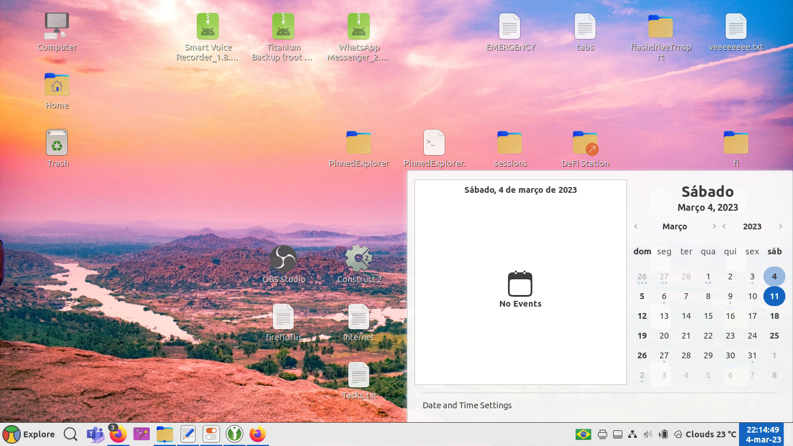

This theme is based off [Yaru-cinnamon](https://github.com/Ubuntu-Cinnamon-Remix/yaru-cinnamon), which is an adaptation of Ubuntu's Yaru theme from Gnome to the Cinnamon DE, made by the folks of the [Ubuntu Cinnamon Remix](https://github.com/Ubuntu-Cinnamon-Remix) distro.

This theme has been forked to match Floflis' design vibes, with some pending colors to change and features to implement.

This repo don't include icons (unlike Yaru's original) in order to keep it organized. And sorry for saying "This" thrice
